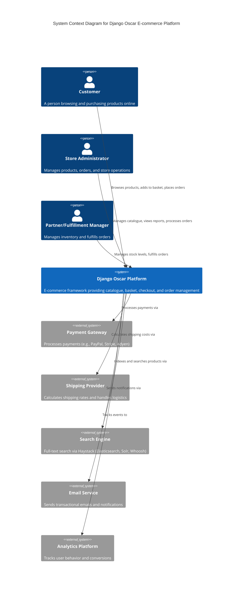

# C4 Context Diagram - Django Oscar E-commerce Platform

This diagram shows the system context - how Django Oscar fits into the broader environment and its interactions with external actors and systems.

## Key Interactions

### Customer Interactions
- Browse product catalogue and categories
- Search for products
- Add products to basket/wishlist
- Complete checkout process
- View order history
- Write product reviews

### Administrator Interactions
- Manage product catalogue (products, categories, attributes)
- Configure offers, vouchers, and promotions
- Process and track orders
- Manage partners and stock levels
- Access analytics and reports via dashboard

### Partner/Fulfillment Interactions
- Update stock records
- View assigned orders
- Mark orders as shipped

### External System Integrations
- **Payment Gateways**: Multiple payment providers supported via extensions
- **Shipping Providers**: Custom shipping methods and rate calculations
- **Search Engines**: Haystack integration for Elasticsearch/Solr/Whoosh
- **Email Services**: Django email backend for transactional emails
- **Analytics**: Event tracking for user behavior and conversions
