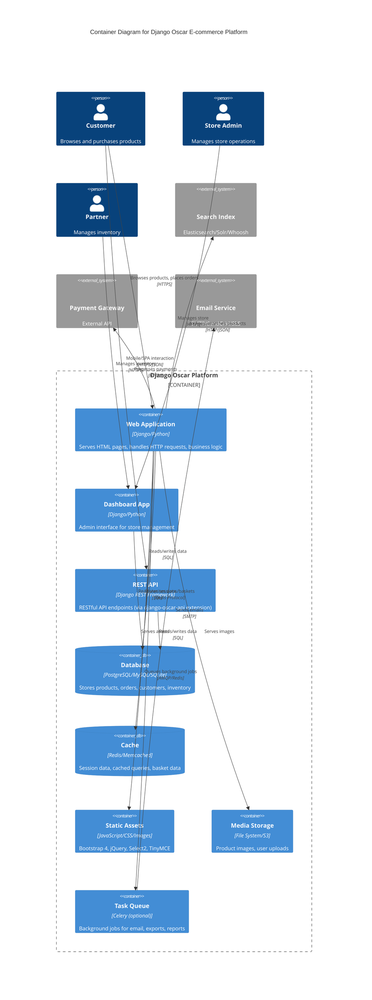

# C4 Container Diagram - Django Oscar E-commerce Platform

This diagram shows the high-level technology choices and how the system is decomposed into containers (applications, databases, file systems, etc.).

## Container Details

### Web Application (Django)
- **Technology**: Python 3.8+, Django 4.2+
- **Responsibilities**:
  - Product catalogue rendering
  - Basket/cart management
  - Checkout flow orchestration
  - Order placement and tracking
  - Customer account management
  - Offer/voucher application
- **Key Apps**: catalogue, basket, checkout, order, customer, offer, voucher, payment, shipping

### Dashboard Application
- **Technology**: Django admin-like interface with Bootstrap 4
- **Responsibilities**:
  - Product and category management
  - Order processing and fulfillment
  - Customer management
  - Reporting and analytics
  - Partner management
  - Offer and voucher configuration
- **Access Control**: Permission-based, can be scoped to specific partners

### REST API (Optional Extension)
- **Technology**: Django REST Framework
- **Extension**: django-oscar-api
- **Responsibilities**:
  - Headless/mobile commerce
  - Third-party integrations
  - SPA (Single Page Application) backend

### Database
- **Primary Options**: PostgreSQL (recommended), MySQL, SQLite (dev only)
- **Schema**:
  - Products and catalogue structure
  - Customer and order data
  - Stock records and partner info
  - Offers, vouchers, and discounts
  - Analytics events

### Cache Layer
- **Technologies**: Redis (recommended), Memcached, Local Memory
- **Uses**:
  - Session storage
  - Basket data (temporary)
  - Query result caching
  - Product availability checks

### Static & Media Files
- **Static**: Bootstrap, jQuery, Select2, TinyMCE, custom CSS/JS
- **Media**: Product images, category images, user uploads
- **Build Process**: Gulp for SCSS compilation and asset copying
- **Storage**: Local filesystem or cloud storage (S3, etc.)

### Search Engine
- **Integration**: Django Haystack
- **Backends**: Elasticsearch, Solr, Whoosh (development)
- **Indexed Data**: Product titles, descriptions, attributes, SKUs

### Task Queue (Optional)
- **Technology**: Celery with Redis/RabbitMQ
- **Common Tasks**:
  - Email sending
  - Report generation
  - Data exports
  - Batch operations
