# C4 Component Diagram - Django Oscar Web Application

This diagram zooms into the Web Application container to show its internal components and how they interact.

```mermaid
C4Component
    title Component Diagram for Django Oscar Web Application

    Container_Boundary(web_app, "Django Oscar Web Application") {
        Component(catalogue_app, "Catalogue App", "Django App", "Product management, categories, attributes, reviews")
        Component(basket_app, "Basket App", "Django App", "Shopping cart, line items, voucher application")
        Component(checkout_app, "Checkout App", "Django App", "Multi-step checkout flow, address/shipping/payment")
        Component(order_app, "Order App", "Django App", "Order placement, tracking, status management")
        Component(payment_app, "Payment App", "Django App", "Payment source handling, transaction recording")
        Component(partner_app, "Partner App", "Django App", "Fulfillment partners, stock records, availability")
        Component(offer_app, "Offer App", "Django App", "Promotional offers, conditions, benefits")
        Component(voucher_app, "Voucher App", "Django App", "Voucher codes, redemption, tracking")
        Component(customer_app, "Customer App", "Django App", "User accounts, profiles, order history")
        Component(address_app, "Address App", "Django App", "User addresses, countries, validation")
        Component(shipping_app, "Shipping App", "Django App", "Shipping methods, cost calculation")
        Component(search_app, "Search App", "Django App", "Product search via Haystack integration")
        Component(analytics_app, "Analytics App", "Django App", "Event tracking, user behavior")
        Component(communication_app, "Communication App", "Django App", "Email notifications, alerts")

        Component(core_loading, "Dynamic Class Loader", "Core Module", "get_class() - enables customization")
        Component(dashboard, "Dashboard", "Django App", "Admin interface with sub-apps for each domain")
    }

    ContainerDb(database, "Database", "PostgreSQL/MySQL", "Persistent storage")
    ContainerDb(cache, "Cache", "Redis", "Temporary data")
    System_Ext(search_index, "Search Engine", "Elasticsearch/Solr")
    System_Ext(payment_gateway, "Payment Gateway", "External Service")

    Rel(catalogue_app, database, "CRUD products/categories", "ORM")
    Rel(catalogue_app, search_index, "Index products", "Haystack")
    Rel(catalogue_app, core_loading, "Uses for customization")

    Rel(basket_app, database, "Persist baskets", "ORM")
    Rel(basket_app, cache, "Cache basket data", "Redis")
    Rel(basket_app, catalogue_app, "Get product info")
    Rel(basket_app, partner_app, "Check availability")
    Rel(basket_app, offer_app, "Apply offers")
    Rel(basket_app, voucher_app, "Apply vouchers")

    Rel(checkout_app, basket_app, "Get basket for checkout")
    Rel(checkout_app, address_app, "Validate addresses")
    Rel(checkout_app, shipping_app, "Calculate shipping")
    Rel(checkout_app, payment_app, "Handle payment")
    Rel(checkout_app, order_app, "Create order")
    Rel(checkout_app, payment_gateway, "Process payment", "HTTPS")

    Rel(order_app, database, "Persist orders", "ORM")
    Rel(order_app, partner_app, "Allocate stock")
    Rel(order_app, communication_app, "Send confirmations")
    Rel(order_app, analytics_app, "Track conversions")

    Rel(partner_app, database, "Manage stock", "ORM")
    Rel(partner_app, catalogue_app, "Link to products")

    Rel(offer_app, basket_app, "Apply discounts to")
    Rel(offer_app, database, "Store offers", "ORM")

    Rel(customer_app, database, "Store user data", "ORM")
    Rel(customer_app, order_app, "View order history")
    Rel(customer_app, address_app, "Manage addresses")

    Rel(search_app, search_index, "Query products", "Haystack")
    Rel(search_app, catalogue_app, "Display results from")

    Rel(dashboard, catalogue_app, "Manage products")
    Rel(dashboard, order_app, "Process orders")
    Rel(dashboard, partner_app, "Manage stock")
    Rel(dashboard, offer_app, "Configure offers")
    Rel(dashboard, customer_app, "Manage customers")

    UpdateLayoutConfig($c4ShapeInRow="4", $c4BoundaryInRow="1")
```



## Component Details

### Catalogue App
- **Models**: Product, ProductClass, Category, ProductAttribute, ProductImage, ProductReview
- **Key Functions**:
  - Hierarchical category tree (django-treebeard)
  - Product variants and parent-child relationships
  - Flexible attribute system (product class attributes)
  - Product reviews and ratings
  - Image management

### Basket App
- **Models**: Basket, Line (basket items), LineAttribute
- **Key Functions**:
  - Anonymous and authenticated baskets
  - Basket merging on login
  - Line-level discount tracking
  - Voucher application
  - Basket freezing during checkout
  - Stock availability checking

### Checkout App
- **Views**: IndexView, ShippingAddressView, ShippingMethodView, PaymentMethodView, PaymentDetailsView, ThankYouView
- **Key Functions**:
  - Multi-step checkout flow
  - Session-based progress tracking
  - Address validation and selection
  - Shipping method selection
  - Payment processing
  - Order placement via OrderPlacementMixin

### Order App
- **Models**: Order, Line (order line items), LinePrice, ShippingAddress, BillingAddress, PaymentEvent, ShippingEvent
- **Key Functions**:
  - Immutable order records
  - Order number generation
  - Status tracking (signals for status changes)
  - Event history (payment, shipping events)
  - Stock allocation on order placement

### Partner App
- **Models**: Partner, StockRecord, StockAlert
- **Key Functions**:
  - Fulfillment partner management
  - Stock level tracking per partner
  - Price management (partner-specific pricing)
  - Availability strategies
  - Stock allocation and deallocation

### Offer App
- **Models**: ConditionalOffer, Condition, Benefit, Range
- **Key Functions**:
  - Rule-based discount engine
  - Conditions (basket value, product count, etc.)
  - Benefits (percentage/absolute discounts, shipping)
  - Product ranges for targeted offers
  - Offer priority and exclusivity

### Voucher App
- **Models**: Voucher, VoucherApplication
- **Key Functions**:
  - Unique voucher codes
  - Usage limits (per user, total)
  - Date-based validity
  - Linked to conditional offers
  - Redemption tracking

### Payment App
- **Models**: Source, SourceType, Transaction, Bankcard
- **Key Functions**:
  - Payment source abstraction
  - Gateway-agnostic design
  - Transaction logging
  - Deferred/pre-auth handling
  - Payment events for audit trail

### Customer App
- **Models**: User (Django auth), Email, CommunicationEventType, Notification, ProductAlert
- **Key Functions**:
  - User registration and login
  - Order history
  - Email preferences
  - Product alerts (back-in-stock notifications)
  - Wishlist integration

### Core Loading System
- **Module**: `oscar.core.loading`
- **Key Function**: `get_class(module_label, classname)`
- **Purpose**:
  - Dynamic class loading for customization
  - Checks local app first, falls back to Oscar core
  - Used throughout Oscar for views, forms, models, utilities
  - Enables "forking" apps without modifying Oscar core

### Dashboard
- **Structure**: Multi-app dashboard with sub-apps
- **Sub-apps**: catalogue, orders, partners, offers, vouchers, users, reports, communications, pages
- **Features**:
  - Permission-based access control
  - Partner-scoped views
  - Bulk operations
  - CSV exports
  - Reporting and analytics views

## Key Design Patterns

### Dynamic Class Loading
All components use `get_class()` to allow customization:
```python
ProductForm = get_class('catalogue.forms', 'ProductForm')
```

### Abstract Base Models
Models inherit from Abstract* classes to enable overriding:
```python
class AbstractProduct(models.Model):
    class Meta:
        abstract = True
```

### Signal-Based Events
Key business events trigger signals:
- `basket_addition` - Product added to basket
- `order_placed` - Order successfully created
- `order_status_changed` - Order status updated
- `user_registered` - New user account created

### Strategy Pattern
- Availability strategies (partner app)
- Pricing strategies (partner app)
- Shipping methods (shipping app)
- Payment sources (payment app)
