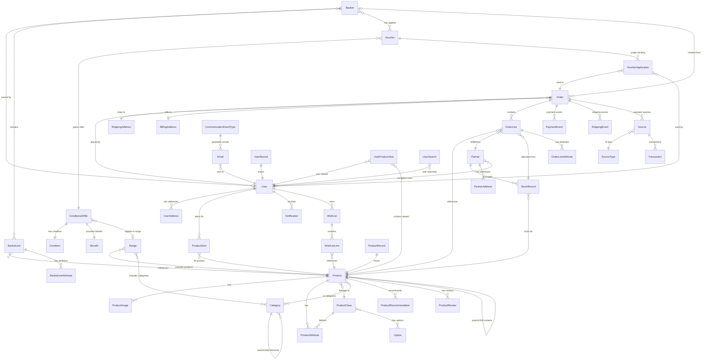

# Domain Model Diagram - Django Oscar E-commerce

This diagram shows the core domain entities and their relationships in the Oscar e-commerce system.

## Core Domain Aggregates

### Catalogue Aggregate
**Root Entity**: Product

**Key Relationships**:
- Product has a ProductClass that defines its structure
- Products can have variants (parent-child relationship)
- Products belong to one or more Categories (hierarchical tree)
- Products have ProductAttributes based on ProductClass
- Products have ProductImages, ProductReviews, ProductRecommendations
- StockRecords link Products to Partners with pricing/availability

**Business Rules**:
- A product must have a ProductClass
- Parent products don't have stock; child variants do
- Product attributes are defined by ProductClass
- Product slugs must be unique within their parent/standalone context

### Basket Aggregate
**Root Entity**: Basket

**Key Relationships**:
- Basket belongs to a User (optional - can be anonymous)
- Basket contains BasketLines (product + quantity)
- BasketLines reference Products and track discounts
- Baskets can have Vouchers applied
- Basket has status: Open, Saved, Frozen, Merged, Submitted

**Business Rules**:
- Anonymous baskets merge with user basket on login
- Basket is frozen during checkout to prevent changes
- Stock availability checked on add to basket
- Offers and vouchers applied at basket level
- BasketLines track line-level discounts separately

### Order Aggregate
**Root Entity**: Order

**Key Relationships**:
- Order created from a Basket
- Order belongs to User (optional for guest checkout)
- Order has OrderLines (immutable copy of basket lines)
- Order has ShippingAddress and BillingAddress
- Order has PaymentEvents (payment lifecycle)
- Order has ShippingEvents (fulfillment lifecycle)
- OrderLines allocated against StockRecords

**Business Rules**:
- Order number is unique and immutable
- Orders are immutable once placed
- Stock allocated on order placement
- Status changes trigger signals
- Payment and shipping events create audit trail
- Total calculated from lines + shipping + discounts

### Partner/Inventory Aggregate
**Root Entity**: Partner

**Key Relationships**:
- Partner has StockRecords for Products
- StockRecord contains price, availability, number in stock
- Partner has PartnerAddresses
- Partner has assigned Users for access control

**Business Rules**:
- Each Product can have multiple StockRecords (multi-partner)
- Stock allocated when order placed
- Stock deallocated on order cancellation
- Availability strategies determine product availability
- Pricing strategies determine product price

### Offer Aggregate
**Root Entity**: ConditionalOffer

**Key Relationships**:
- ConditionalOffer has one Condition (when to apply)
- ConditionalOffer has one Benefit (what discount to give)
- ConditionalOffer optionally applies to a Range of products
- Voucher grants access to an exclusive ConditionalOffer

**Business Rules**:
- Conditions check basket state (value, product count, etc.)
- Benefits provide discounts (percentage, absolute, shipping)
- Offers have priority (lower number = higher priority)
- Some offers are exclusive (can't combine with others)
- Vouchers required for "Voucher" type offers
- Site-wide vs customer-specific offers

### Payment Aggregate
**Root Entity**: Source

**Key Relationships**:
- Order has multiple Sources (split payments)
- Source has SourceType (card, PayPal, etc.)
- Source has Transactions (authorize, debit, refund)
- PaymentEvents track payment lifecycle per Order

**Business Rules**:
- Sources created during checkout
- Transactions record all payment operations
- Pre-auth then capture flow supported
- Refunds reference original transactions
- Payment events aggregate transaction info

## Key Domain Concepts

### Product Variants
- **Standalone Products**: No parent, have stock
- **Parent Products**: Container for variants, no stock
- **Child Products**: Variants of parent, have stock
- Variant attributes typically: size, color, etc.

### Stock Management
- **StockRecord**: Links Product → Partner with pricing
- **Allocation**: Reserves stock when order placed
- **Deallocation**: Returns stock when order cancelled
- **Stock Alerts**: Notify when low stock or out of stock

### Pricing
- Prices stored in StockRecord (partner-specific)
- Tax calculation via pricing strategies
- Currency per basket/order
- Discounts applied via offers/vouchers

### Checkout Flow
1. Basket → Frozen
2. Shipping address selected/created
3. Shipping method chosen
4. Payment method selected
5. Payment processed
6. Order created (basket → order conversion)
7. Stock allocated
8. Confirmation sent
9. Basket → Submitted

### Offer Application
1. Check offer conditions against basket
2. Calculate benefit (discount)
3. Apply to basket lines or shipping
4. Track offer applications
5. Respect priority and exclusivity rules
