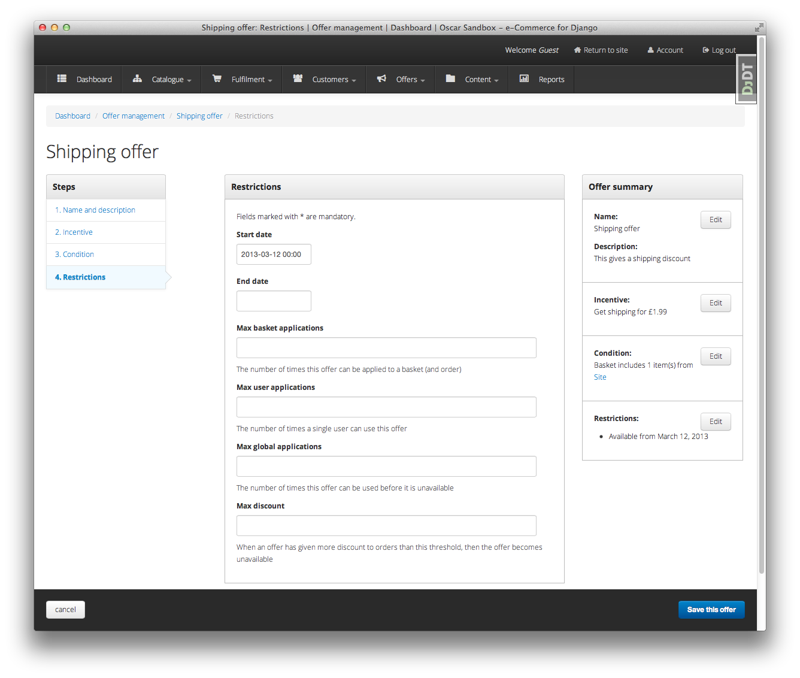
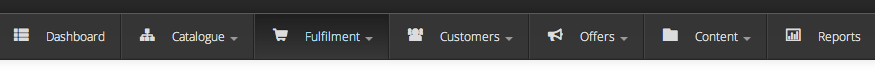
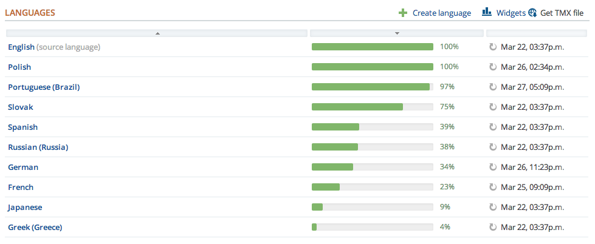
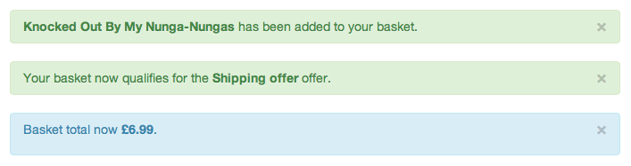

.. spelling::

    jQuery

=======================
Oscar 0.5 release notes
=======================

Welcome to Oscar 0.5!

These release notes cover the `new features`_ as well as `upgrading advice`_.

.. _`new features`: `What's new in Oscar 0.5?`_
.. _`upgrading advice`: `Upgrading`_

Overview
========

The main aim of this release was to add functionality to offers but scope
expanded over time to include many fixes and improvements.  Whilst there aren't
that many new features from a customer perspective, a great deal of work has
gone into reworking Oscar's structure to be more extensible.

Thanks to all the contributors who helped with this release.

What's new in Oscar 0.5?
========================

Offers++
~~~~~~~~

Most of the new features in 0.5 are around offers.

* It is now possible to create custom ranges, conditions and benefits that can
  be used to create flexible offers.  These ranges are created as Python classes
  conforming to a set interface which are registered at compile time to make
  them available in the dashboard.

* Offer benefits can now apply to the shipping charge for an order.  Previously,
  all benefits were applied against the basket lines.  There are three shipping
  benefits ready to use:

    - Fixed discount off shipping (e.g., get £5 off your shipping costs)
    - Percentage discount off shipping (e.g., get 25% off your shipping costs)
    - Fixed price shipping (e.g., your shipping charge will be £5)

* Offer benefits can now be deferred.  That is, they don't affect either the
  basket lines nor the shipping charge.  This is useful for creating benefits
  such as awarding loyalty points.

* Several new ways of restricting an offer's availability have been introduced:

    - An offer's lifetime can now be controlled to the second rather to the day
      (i.e., the relevant model fields used ``datetime`` rather than ``date``). This makes
      it possibly to run offers for a small amount of time (e.g., for a single
      lunchtime).

    - An offer can be restricted to a max number of applications per
      *basket/order*.  For example, an offer can configured so that it can
      only be used once in a single order.

    - An offer can be restricted to a max number of applications per *user*.

    - An offer can be restricted to a max number of *global* applications.

    - An offer can be restricted to give a maximum total discount.  After this
      amount of discount has been awarded, the offer becomes unavailable.

    The restrictions editing page for an offer within the dashboard.

* Offers can now be suspended and reinstated.

* The offers dashboard has been rewritten.

* There is now an offers homepage that lists all active offers.

New dashboard skin
~~~~~~~~~~~~~~~~~~

The design of the dashboard has been reworked, offering a better user experience
throughout the dashboard.  This work is still ongoing, further improvements in
how the dashboard pages are laid out will appear in 0.6.

    The new dashboard navigation.

Internationalisation
~~~~~~~~~~~~~~~~~~~~

Oscar now uses Transifex_ to manage its translation files.  Since 0.4, a
considerable number of new languages are now supported (although many have
partial coverage).

.. _Transifex: https://www.transifex.com/projects/p/django-oscar/

    A snippet from the Oscar Transifex page.

Oscar's default templates also now support a simple language picker.

New settings have been introduced to control how slugs are generated.  By
default, the `Unidecode <https://pypi.org/project/Unidecode/>`_ package is used to gracefully handle non-ASCII chars in
slugs.

Minor features
~~~~~~~~~~~~~~

There are several noteworthy smaller improvements

* The basket page now updates using AJAX rather than page reloads.

* Oscar's documentation has been reorganised and improved.  This is part of an
  ongoing effort to improve it.  Watch this space.

* Oscar's template now use django-compressor_ to compress CSS and JS assets.

* Products can now be deleted using the catalogue dashboard.

* Warnings emails are sent to customers when their password or email address is
  changed.

* Flash messages can now contain HTML.

.. _django-compressor: https://django-compressor.readthedocs.io/en/latest/

Minor improvements
~~~~~~~~~~~~~~~~~~

Several improvements have been made to ease development of Oscar (and Oscar
projects):

* The sandbox can be configured to compile the LESS files directly.  This is
  useful for developing Oscar's CSS/LESS files.

* A new management command ``oscar_fork_statics`` has been added to help with
  setting up static files for a new Oscar project.

* Alternative templates can now be used for different product classes in product
  browsing views.

* jQuery upgraded to 1.9.1

* Bootstrap upgraded to 2.3.1

* The test runner can now be run with tox_.

* Oscar ships with profiling tools.  There is a decorator and middleware
  available in ``oscar.profiling`` that can be used to help profile Oscar sites.

* Customers are notified if changes to their basket lead to new offers being
  applied (or if previously applied offers are no longer available).

    A flash message indicating that the customer's basket has now qualified for
    a new offer.

* Some testing utilities have been extracted into a new package,
  django-oscar-testsupport_, so they can be used by Oscar extensions.

* A Vagrant_ manifest is provided for testing Oscar against different database
  vendors.
* Oscar's Javascript has been rewritten to be cleaner and more extensible.

* Coverage data is now submitted to coveralls.io_

.. _coveralls.io: https://coveralls.io/r/django-oscar/django-oscar
.. _django-oscar-testsupport: https://github.com/django-oscar/django-oscar-testsupport
.. _tox: http://testrun.org/tox/latest/
.. _Vagrant: http://www.vagrantup.com/

Upgrading
=========

This section describes changes in core Oscar that you need to be aware of if you
are upgrading from 0.4.  See the :doc:`upgrading guidelines </topics/upgrading>`
for further details on the steps you need to take.

Migrations
~~~~~~~~~~

There are new migrations in the following apps to be aware of.

* Address:

    - ``0002``: Make ``postcode`` nullable on the ``Address`` model

* Catalogue:

    - ``0009``: Add a ``rating`` field to the product model
    - ``0010``: Populate the new ``rating`` field

.. note::
  Note, if you are using a customised version of the catalogue app, then you
  should create a similar data migration to ``0010`` in your own project.

* Offer:

    - ``0007``: Add ``max_global_applications`` field to ``ConditionalOffer`` model
    - ``0008``: Add ``num_applications`` field to ``ConditionalOffer`` model
    - ``0009``: Rename ``max_applications`` field to ``max_basket_applications``
    - ``0010``: Add ``max_user_applications`` field to ``ConditionalOffer`` model
    - ``0011``: Add ``proxy_class`` field to ``Range`` model
    - ``0012``: Add ``proxy_class`` field to ``Condition`` model and make
      ``range``, ``type`` and ``value`` nullable.
    - ``0013``: Add unique index on ``proxy_class`` for the ``Range`` model
    - ``0014``: Empty migration after branch merge
    - ``0015``: Add ``max_discount`` field to ``ConditionalOffer`` model
    - ``0016``: Add ``status`` field to ``ConditionalOffer`` model
    - ``0017``: Change ``start_date`` and ``end_date`` to use ``datetime``.
    - ``0018``: Rename ``start_date`` and ``end_date`` to ``start_datetime`` and
      ``end_datetime`` respectively.
    - ``0019``: Add ``proxy_class`` field to ``Benefit`` model and make
      ``range``, ``type`` and ``value`` nullable.

* Order:

    - ``0007``: Add ``frequency`` field to ``OrderDiscount`` model
    - ``0008``: Add ``category`` field to ``OrderDiscount`` model
    - ``0009``: Add ``message`` field to ``OrderDiscount`` model

* Partner:

    - ``0004``: Add ``code`` field to ``Partner`` model
    - ``0005``: Populate the new ``code`` field
    - ``0006``: Add unique index on ``code`` field
    - ``0007``: Remove unique index from ``name`` field and make nullable

.. note::
  Note, if you are using a customised version of the partner app, then you
  should create a similar data migration to ``0005`` in your own project.
