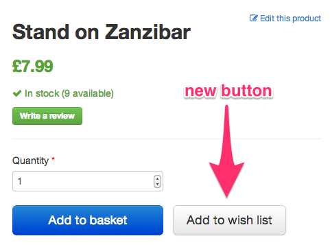
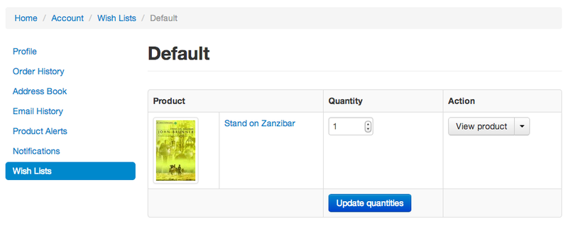
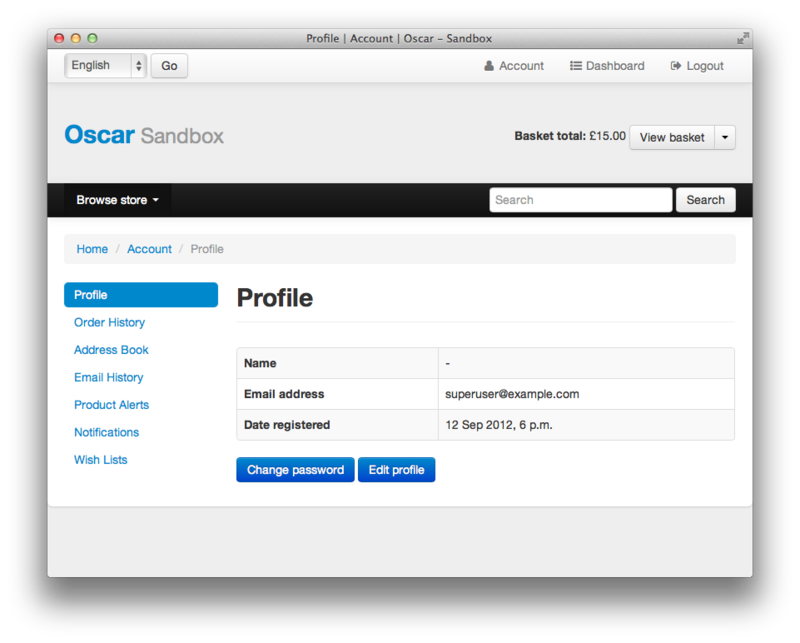
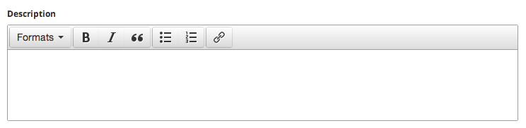
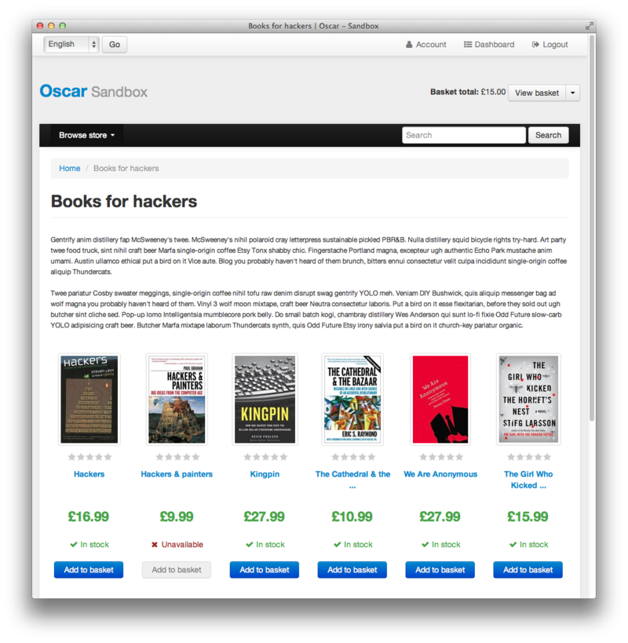

=======================
Oscar 0.6 release notes
=======================

:release: 2014-01-08

It took a while but it's finally here: welcome to Oscar 0.6!

These release notes cover the `new features`_ as well as `backwards incompatible changes`_
that you'll want to be aware of when upgrading from Oscar 0.5 or
earlier.  This release contains some major changes to core APIs which means
many old APIs are scheduled to be dropped - see the `deprecation plan`_ to avoid any
nasty surprises.

When upgrading your Oscar site, make sure you study both the `backwards
incompatible changes`_ and the `deprecated features`_.  If you encounter any
undocumented issues, please let us know on the `mailing list`_.

.. _`new features`: `What's new in Oscar 0.6?`_
.. _`deprecation plan`: `Features deprecated in 0.6`_
.. _`deprecated features`: `Features deprecated in 0.6`_
.. _`backwards incompatible changes`: `Backwards incompatible changes in 0.6`_
.. _`mailing list`: https://groups.google.com/forum/?fromgroups#!forum/django-oscar

Table of contents:

.. contents::
    :local:
    :depth: 1

Overview
========

The biggest change in Oscar 0.6 is the reworking of `pricing and availability`_, which
builds on top of the change to allow `multiple stockrecords per product`_.  The
change is largely backwards compatible with the old system of "partner
wrappers" but it is recommended to upgrade to the new system.  Support for
partner wrappers will be removed for Oscar 0.7.

Oscar 0.6 also introduces better support for marketplace-like functionality
with the so-called permission-based dashboard. It is now possible to give
non-staff users access to a subset of the dashboard's views (products and
orders) by setting the new ``dashboard_access`` permission.

`Oscar now supports Django 1.5`_ and its custom user model.  This has been only
tested in the context of starting a new Oscar project with a custom model.
Switching from a separate "profile" model to the new system is not recommended
at this point.

Oscar also supports Django 1.6 although this is considered experimental at this
stage.  It's possible there are still some incompatibilities that haven't been
teased out just yet.

Other notable new features include:

* A feature-rich `demo site`_ that illustrates how Oscar can be customised.  It
  uses several of Oscar's many extensions such as django-oscar-paypal_,
  django-oscar-datacash_ and django-oscar-stores_.  It is intended as a
  reference site for Oscar.

* `Partners can now have addresses`_.

* `Customer wishlists`_.  Customers can how add products to wishlists and
  manage them within their account section.

* `New helper methods`_ in the ``EventHandler`` class for order processing.

* `Reworked search app`_ with support for easy faceting.

Also, to help justify Tangent's sponsorship of Oscar,
a simple `tracking mechanism`_ has been introduced to keep track of which sites
use Oscar.

.. _`Oscar now supports Django 1.5`: `django_support`_
.. _`Partners can now have addresses`: `Partner dashboard & addresses`_
.. _`Customer wishlists`: `Wishlists`_
.. _`New helper methods`: `Order processing changes`_
.. _`tracking mechanism`: `Tracking Oscar sites`_

What's new in Oscar 0.6?
========================

Multiple stockrecords per product
~~~~~~~~~~~~~~~~~~~~~~~~~~~~~~~~~

Products can now have multiple stockrecords rather than just one.  This is a
key structural change that paves the way for many advanced features.

If a product can be fulfilled by multiple partners, a different stockrecord can
be created for each partner.  This is a common requirement for large-scale
e-commerce sites selling millions of products that use many different
fulfilment partners.

It also allows better support for international sites as stockrecords can be
created for partners in different countries, who sell in different currencies.

See the :doc:`documentation on pricing and availability </topics/prices_and_availability>` for more details.

.. warning::

    This changes means several APIs are `deprecated`_ as they assume there is only
    one stockrecord per product.

.. _`deprecated`: `Features deprecated in 0.6`_

Pricing and availability
~~~~~~~~~~~~~~~~~~~~~~~~

When products can have many stockrecords, a process needs to be in place to
choose which one is selected for a given customer and product.  To handle this,
a new "strategy" class has been introduced, responsible for selecting the appropriate
stockrecord for a given customer and product.

This change also paved the way for reworking how prices, taxes and availability
are handled.  Instead of using `"partner wrappers"`_, the strategy class is
responsible for returning availability details and prices for a particular
product.  New classes known as pricing and availability policies are used to
cleanly encapsulate this information.

These changes allow Oscar to dynamically determine prices, partner and availability
for a given customer and product.  This enables several advanced features such as:

* Fulfilling a product from the partner that offers the best margin.
* Fulfilling a product from the partner geographically closest to the customer.
* Automatically switching to a new partner when when stock runs out.
* Supporting transactions in multiple currencies on the same site.
* Supporting different tax treatments on the same site (e.g. UK VAT and US sales
  tax)
* Having different pricing and availability policies for different customers.

More generally, it provides a structure for customising how pricing,
availability work on a per-customer basis.  This gives a great deal of
flexibility.

See the guide to :doc:`prices and availability </topics/prices_and_availability>`
for more information.

Permission-based dashboard
~~~~~~~~~~~~~~~~~~~~~~~~~~

Three changes were necessary to better support marketplace scenarios within
Oscar:

* Oscar's core :class:`~oscar.core.application.Application` class now supports
  specifying permissions on a per-view basis. This is done via a new default
  decorator. Legacy behaviour is unchanged.

* The dashboard's menus are now built dynamically. If the current user does
  not have access to some views in :ref:`OSCAR_DASHBOARD_NAVIGATION`, they will
  be omitted in the menu returned by
  :meth:`oscar.apps.dashboard.nav.create_menu`.

* The index, catalogue and order dashboard views have been modified to allow
  access to non-staff users. See :doc:`the dashboard documentation </ref/apps/dashboard>` for details.

* The relation :attr:`oscar.apps.partner.abstract_models.AbstractPartner.users` was not
  used by core Oscar prior 0.6. It is now used to model access for the
  permission-based dashboard.

Payment models have abstract versions
~~~~~~~~~~~~~~~~~~~~~~~~~~~~~~~~~~~~~

The models within the :doc:`payment app </ref/apps/payment>` have been split into abstract and
concrete versions.  This brings them inline with other Oscar apps and allows
them to be customised in the normal way.

Wishlists
~~~~~~~~~

Wishlist functionality has finally landed.  Signed in customers are now able to
create multiple named wishlists and add products to them.  There is a new
section in the customer's account where wishlists can be managed.

   *The add-to-wishlist button.*

   *Editing a wishlist*

See the :doc:`wishlist documentation </ref/apps/wishlists>` for more details.

Partner dashboard & addresses
~~~~~~~~~~~~~~~~~~~~~~~~~~~~~

Partners can now have addresses.  These are useful for US sales tax where tax
calculations need to know the origin of a product being shipped.

A dashboard to handle partners, their users and addresses has been added.

Checkout
~~~~~~~~

The :class:`~oscar.apps.checkout.views.PaymentDetailsView` checkout view has
been restructured for flexibility.  There is a new
:meth:`~oscar.apps.checkout.views.PaymentDetailsView.build_submission` method
which is responsible for building a dict of all data for passing to the
``submit`` method.  This includes the shipping address and shipping method
which were previously loaded indirectly within the ``submit`` method.

.. warning::

   While not major, the changes to checkout are backwards incompatible.  See the
   :ref:`backwards compatibility notes <checkout_incompatibilities>` for more details.

Demo site
~~~~~~~~~

Oscar now ships with a demo site along side the sandbox site.  While the sandbox
is a minimal Django project that uses Oscar with all its defaults, the demo site
is a more realistic example of an Oscar project.  It has a custom skin and makes
many alterations to the default Oscar behaviour.

It's features include:

* A range of different product types: books, downloads, clothing
* PayPal Express integration using django-oscar-paypal_
* DataCash integration using django-oscar-datacash_

.. _django-oscar-paypal: https://github.com/django-oscar/django-oscar-paypal
.. _django-oscar-datacash: https://github.com/django-oscar/django-oscar-datacash
.. _django-oscar-stores: https://github.com/django-oscar/django-oscar-stores

See the :doc:`sandbox and demo site documentation </internals/sandbox>` for more details.  A publicly accessible version of the demo site
is available at http://demo.oscarcommerce.com.

.. _django_support:

Django 1.5, 1.6 and custom user model support
~~~~~~~~~~~~~~~~~~~~~~~~~~~~~~~~~~~~~~~~~~~~~

Oscar now supports Django 1.5 and, experimentally, 1.6.

Specifically, Oscar supports `custom user models`_, the headline new feature in Django
1.5.  These can be used standalone or with a one-to-one profile model: Oscar's
account forms inspect the model fields to dynamically pick up the fields for
editing and display.

There are some restrictions on what fields a custom user model must have.  For
instance, Oscar's default authentication backend requires the user model to have an email
and password field.  New Oscar projects are encouraged to use the provided
abstract user model as the base for their users.

Support for Django 1.6 is considered experimental at the moment as there hasn't
been time to run thorough tests for all possible incompatibilities.

Further reading:

* :doc:`How to use a custom user model </howto/use_a_custom_user_model>`.

.. _`custom user models`: https://docs.djangoproject.com/en/dev/topics/auth/customizing/#specifying-a-custom-user-model
.. _`documentation on user models`: https://docs.djangoproject.com/en/dev/topics/auth/customizing/#specifying-a-custom-user-model

Accounts
~~~~~~~~

The views and templates of the accounts section have been reworked to be clearer
and easier to extend.  There is no longer a generic front page for the accounts
section - instead, each subsection has its own page.  The navigation has also
moved to the left-hand side.

   *The new-look account section with navigation on the left-hand side.*

``Bootstrap-WYSIHTML5`` replaced by TinyMCE
~~~~~~~~~~~~~~~~~~~~~~~~~~~~~~~~~~~~~~~

`TinyMCE 4.0`_ is now used in the dashboard for all ``textarea`` elements with
the class ``wysiwyg``.  This has better browser support and is easier to
customise than ``bootstrap-wysihtml5`` (which has now been removed).

It is easy to configure or replace with the HTML editor of your choice.

   *Textarea with class ``wysiwyg`` now use TinyMCE.*

.. _`TinyMCE 4.0`: http://www.tinymce.com/

Improved address fields
~~~~~~~~~~~~~~~~~~~~~~~

The postcode and phone number fields have been improved.

* The postcode field is now validated in the model's
  :meth:`~oscar.apps.address.abstract_models.AbstractAddress.clean` method to
  ensure it is valid for the selected country.

* The phone number field now uses a specialist
  :class:`~oscar.models.fields.PhoneNumberField` field class
  which validates and cleans the phone number.

Better bankcard handling
~~~~~~~~~~~~~~~~~~~~~~~~

In 0.5, there were two classes that representing a bankcard.  These have been
merged - the new version is
:class:`~oscar.apps.payment.abstract_models.AbstractBankcard`.

An instance of this model is returned by the :attr:`~oscar.apps.payment.forms.BankcardForm.bankcard` property.

Customer-facing range pages
~~~~~~~~~~~~~~~~~~~~~~~~~~~

Ranges can now be flagged as public which means they get a customer-facing
detail page which shows a range description and allows its products to be
browsed.

In the dashboard, the display order of the range's products can be controlled.

To this end, the core :class:`~oscar.apps.offer.models.Range` model has been
extended with a HTML description field.

   *A customer-facing range page*

Reworked search app
~~~~~~~~~~~~~~~~~~~

Oscar's search app has been reviewed and simplified.  The main view class
(now :class:`~oscar.apps.search.views.FacetedSearchView`)
has been reworked to provide better support for faceting, which can be easily
specified using the :ref:`oscar_search_facets` setting.

The ``SuggestionsView`` has been removed as it wasn't being used.  A later
version of Oscar will include a replacement.

See the :doc:`search app documentation </ref/apps/search>` for more details.

Order processing changes
~~~~~~~~~~~~~~~~~~~~~~~~

The core :class:`~oscar.apps.order.processing.EventHandler` class has been
extended.

* The ``handle_shipping_event`` method now validates a proposed shipping event
  before saving it.

* The ``handle_payment_event`` method now validates a proposed payment event
  before saving it.

See the :class:`~oscar.apps.order.processing.EventHandler` for the available
methods.

Tracking Oscar sites
~~~~~~~~~~~~~~~~~~~~

Oscar's dashboard now serves a single pixel image from one of Tangent's
servers.  This is included to gather information on which sites use Oscar,
which is an important metric for Tangent, who sponsor Oscar's development.

It can easily be disabled by setting ``OSCAR_TRACKING=False``.  If you do opt
out, please email the mailing list with any production Oscar sites you are
running.  This will help to ensure investment in Oscar's future.

Minor changes
~~~~~~~~~~~~~

* detox_ is a new dependency, which allows running `tox` tests in parallel.

.. _detox: https://pypi.python.org/pypi/detox

* ``OSCAR_ALLOW_ANON_REVIEWS`` has been a documented setting since Oscar 0.4.
  But there's never been any code to support this, which has been rectified with
  this release. Things should now work as expected.

* Oscar uses a cookie to display recently displayed products. This cookie never
  expired and wasn't a ``HttpOnly`` cookie. It is now a ``HttpOnly`` cookie and expires
  after 7 days. Additionally, two settings have been introduced to configure
  it analogues to the basket cookies:
  ``OSCAR_RECENTLY_VIEWED_COOKIE_LIFETIME`` and
  ``OSCAR_RECENTLY_VIEWED_COOKIE_NAME``.

Backwards incompatible changes in 0.6
=====================================

There were quite a few backwards incompatible changes in Oscar 0.6.  There
shouldn't be quite as many in future Oscar releases as we approach 1.0.

Additional apps
~~~~~~~~~~~~~~~

Four new apps are required in your ``INSTALLED_APPS``:

.. code-block:: python

    INSTALLED_APPS = (
        ...
        'oscar.apps.wishlists',
        'oscar.apps.dashboard.pages',
        'oscar.apps.dashboard.partners',
        'oscar.apps.dashboard.reviews',
        ...
    )

If you are using the ``get_core_apps`` helper function, then these new apps
will be added automatically. The new wishlists app contains database migrations,
so you will need to run the ``migrate`` management command.

.. _checkout_incompatibilities:

Checkout app
~~~~~~~~~~~~

Several changes have been made to the checkout in the name of simplification
and making things easier to customise.

The ``PaymentDetailsView`` has been adjusted to explicitly pass variables
around rather than relying on methods that load them on demand.  This makes
customisation easier and everything more explicit (a good thing).

* The ``submit`` method in
  :class:`~oscar.apps.checkout.views.PaymentDetailsView` has a new signature.
  It now accepts the user, shipping address, shipping method and order total as
  required parameters  The intention is that the ``build_submission`` methods
  returns a dict of kwargs for ``submit`` so that it can be called like::

    submission = self.build_submission()
    return self.submit(**submission)

  If your payment or order submission process requires additional parameters
  (e.g.  a bankcard instance), override the ``build_submission`` method to
  provide them.  The dict returned from the new ``build_submission`` method is
  also passed to the template.

* The ``handle_payment`` method in
  :class:`~oscar.apps.checkout.views.PaymentDetailsView` now accepts a
  :class:`~oscar.core.prices.Price` instance instead of a Decimal for the order
  total.

* The ``handle_order_placement`` method in
  :class:`~oscar.apps.checkout.mixins.OrderPlacementMixin`
  now accepts the user, shipping address and shipping method in a
  different order consistent with the ``submit`` method from
  ``PaymentDetailsView``.

* The ``place_order`` method in
  :class:`~oscar.apps.checkout.mixins.OrderPlacementMixin`
  has a new signature.  The parameters have been reordered and the shipping
  address, shipping method and billing address must be passed in explicitly (as
  unsaved instances).

* The ``create_shipping_address`` method in
  :class:`~oscar.apps.checkout.mixins.OrderPlacementMixin` has changed
  signature.  Instead of being passed a basket, it is now passed the user and
  an unsaved shipping address instance.

* The ``create_billing_address`` method in
  :class:`~oscar.apps.checkout.mixins.OrderPlacementMixin` has changed
  signature.  It is now passed an unsaved billing address instance as well as
  a shipping address instance.

* The ``get_shipping_method`` (from
  :class:`~oscar.apps.checkout.session.CheckoutSessionMixin`) no longer
  defaults to returning free shipping if no shipping method can be looked up.

* The :class:`~oscar.apps.checkout.calculators.OrderTotalCalculator` now
  returns a :class:`~oscar.core.prices.Price` instance from a new ``calculate``
  method.  The old methods ``order_total_incl_tax`` and
  ``order_total_excl_tax`` have been removed.

Other changes:

* The checkout gateway page has a new option "Register and continue" which allows a customer
  to register before checking out.  As part of this change, the option value ``new`` in
  ``GatewayForm`` has changed to ``guest`` as ``new`` option is used for this feature.

* The checkout decorators ``basket_required`` and ``prev_steps_must_be_complete`` have been removed as they were
  no longer used.

Shipping app changes
~~~~~~~~~~~~~~~~~~~~

The default implementation of the
:class:`~oscar.apps.shipping.repository.Repository` class
has been adjusted to avoid thread-safety issues.  If you define your own
shipping ``Repository`` class, ensure that your shipping methods are
instantiated per-request and not at compile time.

For example, avoid this:

.. code-block:: python

   from oscar.apps.shipping import repository

   class Repository(repository.Repository)
       # Don't instantiate at compile time!
       methods = [SomeMethod(), AnotherMethod()]

Instead, instantiate the methods within ``get_shipping_methods``:

.. code-block:: python

   from oscar.apps.shipping import repository

   class Repository(repository.Repository)
       # Note, methods are not instantiated.  The get_shipping_methods
       # method will instantiate them.
       methods = [SomeMethod, AnotherMethod]

.. warning::

    Beware of shipping methods that are configured via constructor parameters, like
    :class:`~oscar.apps.shipping.methods.FixedPrice`.  If you are using methods
    that work this way, ensure you instantiate them at runtime.

    Shipping methods will be reworked for Oscar 0.7 to avoid these issues.

Address model changes
~~~~~~~~~~~~~~~~~~~~~

* The ``UserAddress.salutation`` and ``UserAddress.name`` methods are now
  properties.

* The ``Country`` model's ``is_highlighted`` column has been renamed to
  ``display_order`` and is now an integer field to allow fine-grained country
  selection.

Basket app changes
~~~~~~~~~~~~~~~~~~

Several properties of the basket ``Line`` model have been renamed:

* ``Line.line_price_excl_tax_and_discounts`` has been renamed to
  ``Line.line_price_excl_tax_incl_discounts``.

* ``Line.line_price_incl_tax_and_discounts`` has been renamed to
  ``Line.line_price_incl_tax_incl_discounts``.

The :func:`~oscar.templatetags.basket_tags.basket_form` templatetag has been
altered to take the ``request`` as the first parameter, not ``request.basket``.

Catalogue app changes
~~~~~~~~~~~~~~~~~~~~~

3 properties have been removed from
:class:`oscar.apps.catalogue.abstract_models.AbstractProductImage` as they
were unused: ``resized_image_url``, ``fullsize_url`` and ``thumbnail_url``.
Thumbnailing is instead achieved in templates with :py:mod:`sorl-thumbnail`.

* The function ``add_category_from_breadcrumbs`` was not used and has been
  removed.

* Alternative product class templates now use ``slug`` field instead of
  ``name.lower()`` to determine their filename.  If you have templates for
  specific product classes, please update your filenames accordingly

Customer app changes
~~~~~~~~~~~~~~~~~~~~

The :class:`oscar.apps.customer.forms.EmailAuthenticationForm` form now needs to
be instantiated with a host name so prevent redirects to external sites.

Offer app changes
~~~~~~~~~~~~~~~~~

The ManyToManyField ``included_product`` of the
:class:`~oscar.apps.offer.models.Range` model was changed to use ``through``
relationship:

* Use ``Range.add_product(product)`` instead of
  ``Range.included_product.add(product)``.
* Use ``Range.remove_product(product)`` instead of
  ``Range.included_product.remove(product)``.

When adding a product into a range, position in the range can be specified
with ``display_order`` parameter:
``Range.add_product(product, display_order=3)``

Payment app changes
~~~~~~~~~~~~~~~~~~~

The balance method on the
:class:`~oscar.apps.payment.abstract_models.AbstractSource` model is now a property, not a method.

Reviews app changes
~~~~~~~~~~~~~~~~~~~

The two product review forms, ``SignedInUserProductReviewForm`` and
``AnonymousUserProductReviewForm``, have been replaced by a new
:class:`oscar.apps.catalogue.reviews.forms.ProductReviewForm`.

Search app changes
~~~~~~~~~~~~~~~~~~

Some of the names have been simplified.

* The ``MultiFacetedSearchView`` and ``SuggestionsView`` view classes have been
  removed.  The ``MultiFacetedSeachView`` class is replaced by ``FacetedSearchView``.

* The ``MultiFacetedSearchForm`` has been removed in favour of
  ``SearchForm``.

Loading baskets
~~~~~~~~~~~~~~~

Now that products can have multiple stockrecords, several changes have been made
to baskets to allow the appropriate stockrecord to be tracked for each basket
line.  The basket line model has a new field that links to the selected
stockrecord and the basket itself requires an instance of the strategy class so
that prices can be calculated for each line.  Hence, if you loading baskets
and manipulating baskets directly, you need to assign a strategy class in order
for prices to calculate correctly:

.. code-block:: python

    from oscar.apps.basket import models

    basket = models.Basket.objects.get(id=1)
    basket.strategy = request.strategy

Without an assigned strategy class, a basket will raise a ``RuntimeError`` when
attempting to calculate totals.

Renamed templates
~~~~~~~~~~~~~~~~~

Some templates have been renamed for greater consistency.  If you are overriding
these templates, ensure you rename your corresponding project templates.

Many of the profile templates have been reorganised:

* ``customer/address_list.html`` is renamed to
  ``customer/address/address_list.html``

* ``customer/address_form.html`` is renamed to
  ``customer/address/address_form.html``

* ``customer/address_delete.html`` is renamed to
  ``customer/address/address_delete.html``

* ``customer/email.html`` is renamed to
  ``customer/email/email_detail.html``

* ``customer/email_list.html`` is renamed to
  ``customer/email/email_list.html``

* ``customer/order.html`` is renamed to
  ``customer/order/order_detail.html``

* ``customer/order_list.html`` is renamed to
  ``customer/order/order_list.html``

* ``customer/profile.html`` is renamed to
  ``customer/profile/profile.html``

* ``customer/profile_form.html`` is renamed to
  ``customer/profile/profile_form.html``

* ``customer/change_password_form.html`` is renamed to
  ``customer/profile/change_password_form.html``

* ``partials/nav_profile.html`` has been removed.

Template block changes
~~~~~~~~~~~~~~~~~~~~~~

* The template ``dashboard/orders/order_detail.html`` has been reorganised.  The
  ``tab_transactions`` block has been renamed to ``payment_transactions``.

* In ``checkout/checkout.html``, the ``checkout-nav`` block has been renamed
  ``checkout_nav``.

Changes to Partner permissions
~~~~~~~~~~~~~~~~~~~~~~~~~~~~~~

The following permissions on the
:class:`~oscar.apps.partner.abstract_models.AbstractPartner` model were not
used in Oscar and have been removed to avoid confusion with the newly
introduced permission-based dashboard:

* ``can_edit_stock_records``
* ``can_view_stock_records``
* ``can_edit_product_range``
* ``can_view_product_range``
* ``can_edit_order_lines``
* ``can_view_order_lines``

The permission-based dashboard introduced a new permission:

* ``dashboard_access``

Migrations
~~~~~~~~~~

There are rather a lot of new migrations in Oscar 0.6.  They are all detailed
below.

If you are upgrading and your project overrides one of these apps with
new migrations, then ensure you pick up the schema changes in a new migration
within your app.  You can generally do this using ``manage.py schemamigration
$APP --auto`` but check the corresponding core migration to ensure there aren't
any subtleties that are being overlooked.

Some of these migrations rename fields for consistency, while others ensure
``CharField`` fields are not nullable.

* Address:

    - ``0003``: A new field ``display_order`` is added to the ``Country``
      model.  This is the first of 3 migrations that replace the
      boolean ``is_highlighted`` field with an integer field that allows
      fine-grained control of the order of countries in dropdowns.
    - ``0004``: A data migration to ensure highlighted countries have a display
      order of 1.
    - ``0005``: Remove the ``is_highlighted`` field from the ``Country`` model
      as it is no longer necessary.
    - ``0006``: Add a uniqueness constraint across ``user_id`` and ``hash`` for
      the ``UserAddress`` model to prevent duplicate addresses.
    - ``0007``: Use a custom field for address postcodes.

* Basket:

    - ``0004``: Add ``stockrecord`` field to the ``Line`` model to track which
      stockrecord has been selected to fulfil a particular line.
    - ``0005``: Add ``price_currency`` field to the ``Line`` model.

* Catalogue:

    - ``0011``: Larger ``max_length`` on FileFields and ImageFields
    - ``0012``: Use ``NullBooleanField`` for the ``value_boolean`` field of
      the ``ProductAttributeValue`` model.
    - ``0013``: Add ``value_file`` and ``value_image`` fields to the
      ``ProductAttributeValue`` model to support file and image attributes.

* Customer:

    - ``0005``: Don't allow ``sms_template`` field of
      ``CommunicationEventType`` model to be nullable.

* Dashboard:

    - ``0002``: Don't allow ``error_message`` field of
      ``RangeProductFileUpload`` model to be nullable.

* Offer app:

    - ``0020``: Data migration to set null offer descriptions to empty string.
    - ``0021``: Don't allow null offer descriptions or benefit types.
    - ``0022``: Add a ``slug`` field to the :class:`~oscar.apps.offer.models.Range` model.
    - ``0023``: A data migration to populate the new range slug field.
    - ``0024``: Add a ``is_public`` field to the :class:`~oscar.apps.offer.models.Range` model.
    - ``0025``: Add a ``description`` field to the :class:`~oscar.apps.offer.models.Range` model.
    - ``0026``: Add a ``applies_to_tax_exclusive_price`` field to
      ``ConditionalOffer`` model to try and handle offers that apply in both
      the US and UK (this field is later removed).
    - ``0027``: Create a joining table for the new M2M relationship between
      ranges and products.
    - ``0028``: Remove ``applies_to_tax_exclusive_price`` field.

* Order app:

    - ``0010``: Allow postcodes for shipping- and billing addresses to be
      nullable.
    - ``0011``: Rename ``date`` field on ``CommunicationEvent``,
      ``ShippingEvent`` and ``PaymentEvent`` models to be ``date_created``.
    - ``0012``: Add ``reference`` field to ``PaymentEvent`` model.
    - ``0013``: Add a foreign key to ``ShippingEvent`` from ``PaymentEvent``
      model.
    - ``0014``: Change ``postcode`` field on ``ShippingAddress`` and
      ``BillingAddress`` models to use ``UppercaseCharField`` field.
    - ``0015``: Remove ``is_required`` and ``sequence_number`` fields from
      ``ShippingEventType`` and ``PaymentEventType`` models.
    - ``0016``: Add ``currency`` field to ``Order model``.  Add a foreign key
      to the ``StockRecord`` model from the ``Line`` model.
    - ``0017``: Add a ``shipping_code`` field to the ``Order`` model.
    - ``0018``: ``ShippingAddress``'s ``phone_number`` is now a ``PhoneNumberField``
      to allow better validation.

* Partner app:

    - ``0008``: Remove unnecessary ``partner_abstractstockalert`` table.
    - ``0009``: Create table for new ``PartnerAddress`` model.
    - ``0010``: Remove uniqueness constraint on ``product_id`` for the
      ``StockRecord`` model.  This allows a product to have more than one
      stockrecord.

* Payment app:

    - ``0002``: Ensure all ``CharField`` fields are not nullable.  This
      migration handles both the data- and schema-migration in one.

* Promotions app:

    - ``0002``: Ensure all ``CharField`` fields are not nullable.
    - ``0003``: Extend the ``max_length`` of the ``image`` field.

* Wishlist app:

    - ``0001``: Initial table creation

Features deprecated in 0.6
==========================

Accessing a product's stockrecords
~~~~~~~~~~~~~~~~~~~~~~~~~~~~~~~~~~

Several properties and methods of the core
:class:`~oscar.apps.catalogue.abstract_models.AbstractProduct`  class have been
deprecated following the change to allow multiple stockrecords per product.

* The :attr:`~oscar.apps.catalogue.abstract_models.AbstractProduct.has_stockrecord` property
  no longer makes sense when there can be more than one stockrecord.  It is
  replaced by
  :attr:`~oscar.apps.catalogue.abstract_models.AbstractProduct.has_stockrecords`

* The :attr:`~oscar.apps.catalogue.abstract_models.AbstractProduct.stockrecord` property is
  deprecated since it presumes there is only one stockrecord per product.
  Choosing the appropriate stockrecord is now the responsibility of the
  :ref:`strategy class <strategy_class>`.  A backward compatible version has
  been kept in place that selects the first stockrecord for a product.  This
  will continue to work for sites that only have one stockrecord per product.

All availability logic has been moved to :ref:`availability policies<availability_policies>`
which are determined by the :ref:`strategy class <strategy_class>`.

* The :attr:`~oscar.apps.catalogue.abstract_models.AbstractProduct.is_available_to_buy` property
  is deprecated.  The functionality is now part of availability policies.

* The :meth:`~oscar.apps.catalogue.abstract_models.AbstractProduct.is_purchase_permitted` method
  is deprecated.  The functionality is now part of availability policies.

Checkout session manager
~~~~~~~~~~~~~~~~~~~~~~~~

The ``shipping_method`` method of the
:class:`~oscar.apps.checkout.utils.CheckoutSessionData` is now deprecated in
favour of using ``shipping_method_code``.  It is being removed as the
``CheckoutSessionData`` class should only be responsible for retrieving data
from the session, not loading shipping method instances.

Checkout order placement mixin
~~~~~~~~~~~~~~~~~~~~~~~~~~~~~~

The following methods within
:class:`~oscar.apps.checkout.mixins.OrderPlacementMixin` are deprecated as the
flow of placing an order has been changed.

* :meth:`~oscar.apps.checkout.mixins.OrderPlacementMixin.create_shipping_address_from_form_fields`
* :meth:`~oscar.apps.checkout.mixins.OrderPlacementMixin.create_shipping_address_from_user_address`
* :meth:`~oscar.apps.checkout.mixins.OrderPlacementMixin.create_user_address`

Bankcard model
~~~~~~~~~~~~~~

The :attr:`~oscar.apps.payment.abstract_models.AbstractBankcard.card_number`
is deprecated in favour of using
:attr:`~oscar.apps.payment.abstract_models.AbstractBankcard.number`.

"Partner wrappers"
~~~~~~~~~~~~~~~~~~

Before Oscar 0.6, availability and pricing logic was encapsulated in "partner
wrappers".  A partner wrapper was a class that provided availability and price
information for a particular partner, as specified by the
``OSCAR_PARTNER_WRAPPERS`` setting.  The stockrecord model had several
properties and methods
which delegated to the appropriate wrapper for the record's partner.

This functionality is now deprecated in favour of using :ref:`strategy classes <strategy_class>`.
How prices and taxes are determined is not generally a function of the partner,
and so this system was not a good model.  Strategy classes are much more
flexible and allow better modelling of taxes and availability.

The following properties and methods from :class:`~oscar.apps.partner.abstract_models.StockRecord`
are deprecated and will be removed for Oscar 0.7.  These are all convenience
properties and methods that delegate to the appropriate partner wrapper.

* :attr:`AbstractStockRecord.is_available_to_buy <oscar.apps.partner.abstract_models.AbstractStockRecord.is_available_to_buy>`
* :meth:`AbstractStockRecord.is_purchase_permitted <oscar.apps.partner.abstract_models.AbstractStockRecord.is_purchase_permitted>`
* :attr:`AbstractStockRecord.availability_code <oscar.apps.partner.abstract_models.AbstractStockRecord.availability_code>`
* :attr:`AbstractStockRecord.availability <oscar.apps.partner.abstract_models.AbstractStockRecord.availability>`
* :attr:`AbstractStockRecord.max_purchase_quantity <oscar.apps.partner.abstract_models.AbstractStockRecord.max_purchase_quantity>`
* :attr:`AbstractStockRecord.dispatch_date <oscar.apps.partner.abstract_models.AbstractStockRecord.dispatch_date>`
* :attr:`AbstractStockRecord.lead_time <oscar.apps.partner.abstract_models.AbstractStockRecord.lead_time>`
* :attr:`AbstractStockRecord.price_incl_tax <oscar.apps.partner.abstract_models.AbstractStockRecord.price_incl_tax>`
* :attr:`AbstractStockRecord.price_tax <oscar.apps.partner.abstract_models.AbstractStockRecord.price_tax>`

All the above properties and methods have effectively been moved to the availability and pricing
policies that a strategy class is responsible for loading.  To upgrade your
project, replace your partner wrapper classes with equivalent
:doc:`availability and pricing policies </topics/prices_and_availability>`.

Test support extension brought back into core
~~~~~~~~~~~~~~~~~~~~~~~~~~~~~~~~~~~~~~~~~~~~~

The `Oscar test support library`_ has been ported back into Oscar core.  This
simplifies things and avoids circular dependency issues.  If your project is
using this extension, you should remove it as a dependency and use the
analogous functionality from ``oscar/test/``.

.. _`Oscar test support library`: https://github.com/django-oscar/django-oscar-testsupport
